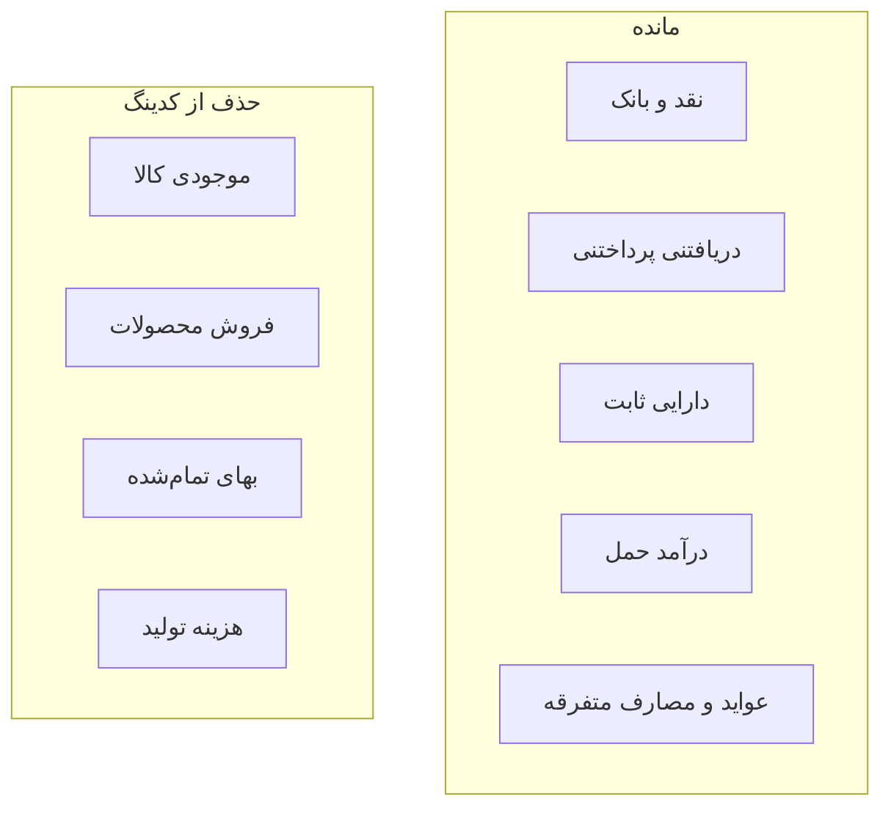

# پاک‌سازی کدینگ و تکمیل گزارش لیجر/روزنامه (Transport)

محدوده: فقط [`HamgamTransport.Server`](HamgamTransport.Server) و [`hamgamtransport.client`](hamgamtransport.client). ناوبری دست نخورده می‌ماند (از قبل تمیز است). CementWeb جداگانه تغییر نمی‌کند.

## ۱) کدینگ حساب — حذف فروش / تولید / موجودی

### حساب‌هایی که حذف می‌شوند (سیدر تازه + پاک‌سازی DB موجود)

| کد | نام | SystemCode |
|----|-----|------------|
| 13 / 131–133 | موجودی کالا و زیرمجموعه‌ها | `SYS_INVENTORY*` |
| 41 / 411 | فروش محصولات / فروش کالا | `SYS_SALES` |
| گروه ۵ / 51 / 511 / 52 / 521 | بهای تمام‌شده و تعدیل موجودی | `SYS_COGS*` / `SYS_INV_ADJ` |
| 612–615 | هزینه‌های تولید | `SYS_PROD_*` |

### حساب‌هایی که می‌مانند (دامنه ترانسپورت)

- نقد/بانک، دریافتنی/پرداختنی، دارایی ثابت (ماشین‌آلات/وسایل)، استهلاک، حقوق مالکانه، تسعیر، مالیات، مطالبات مشکوک
- درآمد حمل (`SYS_TRANSPORT_REV` از [`TransportSchemaSeeder`](HamgamTransport.Server/Data/Seed/TransportSchemaSeeder.cs))
- سایر درآمدها / هزینه متفرقه / عملیاتی / استهلاک / حقوق
- بدهی مالکان و رانندگان

### تغییرات فایل‌ها

- [`ChartOfAccountsSeeder.cs`](HamgamTransport.Server/Data/Seed/ChartOfAccountsSeeder.cs): از seed اولیه آیتم‌های بالا را حذف؛ متد `EnsureProductionCostAccountsAsync` حذف یا خالی شود تا دوباره ساخته نشوند؛ `MapCategoryAccountsAsync` فقط `MISC_*` را مپ کند.
- سیدر جدید مثلاً `ManufacturingAccountsCleanupSeeder`: برای DBهای موجود، حساب‌های بالا را **soft-delete** کند اگر هیچ `JournalLine` فعالی نداشته باشند؛ در غیر این صورت دست نزند (تاریخچه حفظ شود). دسته‌های `PRODUCT_SALE` / `PRODUCT_PURCHASE` را soft-delete کند.
- [`FinanceCategoryService.cs`](HamgamTransport.Server/Services/FinanceCategoryService.cs): دیگر دسته‌های محصول را seed نکند.
- فراخوانی cleanup در [`DataSeeder.cs`](HamgamTransport.Server/Data/Seed/DataSeeder.cs) بعد از COA.

ثابت‌های `AccountSystemCode` و مسیرهای مردهٔ Invoice/Production در بک‌اند فعلاً حذف کامل نمی‌شوند (خارج از اسکوپ UI)؛ فقط از کدینگ فعال و سیدر خارج می‌شوند تا سیستم «فقط درآمد/هزینه + بار + ماشین‌آلات» دیده شود.

---

## ۲) روزنامچه — مناسب ترانسپورت و کامل

وضعیت فعلی [`JournalPage.jsx`](hamgamtransport.client/src/Pages/Reporting/JournalPage.jsx): شش بخش شامل خرید/فروش/تولید (مانده کارخانه). روزنامچه عمومی HTML کامل است؛ عواید/مصارف فقط هدر سند هستند.

### UI

در `JournalPage` فقط این بخش‌ها بمانند:

- روزنامچه عمومی (دفتر روزنامه دوطرفه) — مثل الان
- روزنامچه عواید
- روزنامچه مصارف
- روزنامچه حمل/سرویس — فیلتر `JournalSource.TransportTrip` / `TripExpense`

خرید / فروش / تولید حذف شوند؛ متن راهنما به‌روز شود.

### بک‌اند

در [`JournalReportService.cs`](HamgamTransport.Server/Services/JournalReportService.cs) و [`ReportViewerController.cs`](HamgamTransport.Server/Controllers/Reports/ReportViewerController.cs):

- عواید و مصارف را مثل `BuildStandardJournalPrintModelAsync` به **خطوط دیبت/کریدیت** ارتقا بده (نه فقط جمع هدر)؛ فیلتر روی `JournalSource.Revenue` / `Expense`.
- برای حمل: همان مدل چاپ استاندارد با فیلتر سورس‌های ترانسپورت.
- مسیرهای Stimulsoft خرید/فروش/تولید را از UI قطع کن؛ کد مرده می‌تواند بماند یا بدون استفاده بماند.

خروجی چاپ: همان الگوی HTML A4 موجود (`StandardJournal.cshtml`) با عنوان مناسب هر نوع — کم‌ریسک‌تر از دستکاری قالب Stimulsoft.

---

## ۳) لیجر (دفتر کل) — گزارش کامل

وضعیت: API [`GET /api/finance/accounts/{id}/ledger`](HamgamTransport.Server/Controllers/Finance/AccountController.cs) و مودال در Accounts هست؛ صفحه/چاپ/آیتم منو گزارشات نیست.

### کارها

1. صفحه جدید [`LedgerPage.jsx`](hamgamtransport.client/src/Pages/Reporting/LedgerPage.jsx): انتخاب حساب (از درخت/لیست معین قابل‌ثبت)، بازه تاریخ، فیلتر اختیاری طرف‌حساب، جدول گردش با مانده افتتاحیه/جاری/اختتامیه (reuse [`ledgerApi.js`](hamgamtransport.client/src/services/ledgerApi.js)).
2. مسیر + lazy route + آیتم منو گزارشات: «دفتر کل» کنار روزنامچه.
3. چاپ: endpoint جدید در `ReportViewerController` مثلاً `/report-viewer/ledger?accountId=&dateFrom=&dateTo=&partyId=` + View HTML شبیه روزنامچه عمومی (ستون‌ها: تاریخ، شماره سند، شرح، دیبت، کریدیت، مانده).
4. پرمیشن: هم‌تراز گزارش روزنامچه / مشاهده حساب‌ها.

مودال گردش حساب در کدینگ می‌ماند؛ گزارش جداگانه برای چاپ و استفاده روزمره است.

---

## ترتیب اجرا

1. Cleanup سیدر کدینگ + دسته‌ها + توقف seed تولید/فروش
2. ارتقای سرویس/ویوئر روزنامچه + ساده‌سازی UI روزنامچه
3. صفحه و چاپ لیجر + ناوبری گزارشات
4. بیلد سرور/کلاینت برای اطمینان از کامپایل
